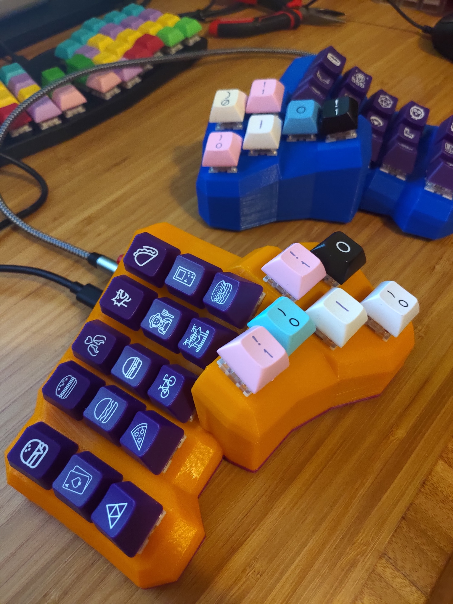

# Dactylria - a Dactyl ManuForm Keyboard fork with thumbs inspired by Kyria and Keyboardio Model 01

This is a fork of [Carbonfet's Dactyl Manuform](http://github.com/carbonfet/dactyl-manuform), which is a fork of the [Dactyl ManuForm Mini](https://github.com/l4u/dactyl-manuform-mini-keyboard), which is a fork of the [Dactyl-ManuForm](https://github.com/tshort/dactyl-keyboard). The Dactyl-Manuform is a fork of the [Dactyl](https://github.com/adereth/dactyl-keyboard) with the thumb cluster from [ManuForm](https://github.com/jeffgran/ManuForm). 

STL files available in things directory

## Generate OpenSCAD and STL models

* Run `lein generate` or `lein auto generate`
* This will regenerate the `things/*.scad` files
* Use OpenSCAD to open a `.scad` file.
* Make changes to design, repeat `load-file`, OpenSCAD will watch for changes and rerender.
* When done, use OpenSCAD to export STL files

## License

Copyright © 2015-2018 Matthew Adereth, Tom Short and Leo Lou

The source code for generating the models is distributed under the [GNU AFFERO GENERAL PUBLIC LICENSE Version 3](LICENSE).

The generated models are distributed under the [Creative Commons Attribution-ShareAlike 4.0 International (CC BY-SA 4.0)](LICENSE-models).
